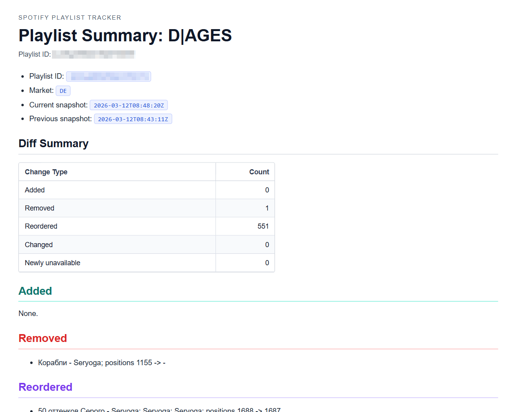
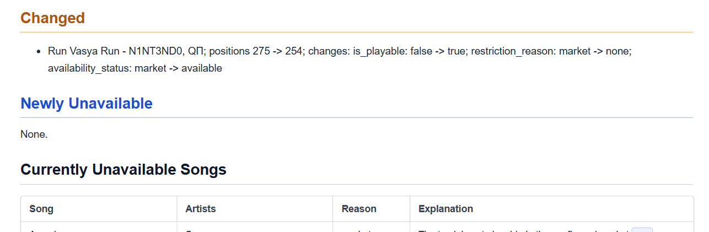
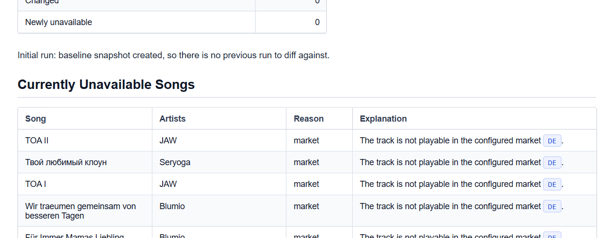
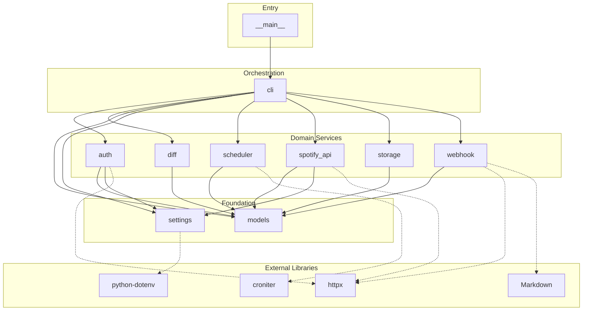

# Spotify Playlist Tracker

I got annoyed by Spotify randomly disappearing tracks from my playlist without a way for me to easily notice or track the changes, so I created this project.

Tracks Spotify playlist changes across repeated runs, stores normalized snapshots, raw Spotify payloads, and diffs, optionally renders markdown summaries, and can notify via webhook (markdown & HTML payload, useful for email via n8n or similar). Designed to run locally or inside Docker.

> Disclaimer: Quick, vibe-coded prototype for personal use. Do NOT rely on this code.

## What It Does

The main workflow is the **`check`** command. On every run it:

1. Fetches playlist items from the Spotify API for each configured playlist.
2. Saves a **snapshot** JSON
3. Compares the current snapshot against the previous one and saves a **diff** JSON when changes are detected.
4. Creates a **markdown summary** on the initial run or when the diff contains removals, reorders, metadata changes, or newly unavailable tracks. Summaries are skipped when the only changes are added tracks (override with `--force-summary`).
5. Sends a **webhook** per generated summary when `TRACKER_SUMMARY_WEBHOOK_URL` is configured. The payload includes both markdown and HTML, suitable for email delivery.

The **`run`** command wraps `check` with a schedule loop — it runs `check` immediately, then repeats according to `TRACKER_SCHEDULE`.

Additionally:

- **`checkunavailable`** fetches the current playlist state, finds unavailable tracks, performs batch track metadata lookups, and writes both a JSON and markdown unavailable summary with per-track market availability details.
- **`authorize`** performs the one-time Spotify OAuth2 flow and saves the token file.

The webhook-delivered email can look something like this:



---



---



## Runtime Configuration

Runtime configuration is environment-driven. The easiest local setup is to copy values into `.env`. The app needs to go through the Spotify authorization flow at least once to create the initial token file, which can then be reused for subsequent runs.

Required variables:

- `SPOTIFY_CLIENT_ID`
- `SPOTIFY_CLIENT_SECRET`
- `SPOTIFY_PLAYLIST_IDS`

Optional variables:

- `SPOTIFY_REDIRECT_URI`
  Default: `http://127.0.0.1:8899/callback`
  For a hosted Docker deployment, set this to your public callback URL such as `http://your-server:8899/callback` or `http://192.168.178.69:8899/callback`.
  The built-in authorization flow currently requires an explicit port in `SPOTIFY_REDIRECT_URI`.
- `SPOTIFY_MARKET`
  Default: `US`
- `SPOTIFY_INCLUDE_EPISODES`
  Default: `false`
- `TRACKER_RESULTS_DIR`
  Default: `results`
- `TRACKER_AUTH_FILE`
  Default: `state/.auth`
- `TRACKER_AUTH_BIND_HOST`
  Optional callback listener bind host. Leave empty for local runs. For hosted or Docker deployments this should usually be `0.0.0.0` so the callback listener accepts inbound requests for your public hostname.
- `TRACKER_SCHEDULE`
  Default: `daily`
  Presets: `hourly`, `daily`, `weekly`, `monthly`
  Also supports a standard 5-field cron expression in UTC
- `TRACKER_SUMMARY_WEBHOOK_URL`
  Optional webhook endpoint for markdown summaries
- `TRACKER_WEBHOOK_TIMEOUT_SECONDS`
  Default: `15`

Example `.env` values are provided in `.env.example`.

## Commands

### `check`

The main command. Runs a single tracker pass: fetch → snapshot → diff → summary → webhook.

Parameters:

| Flag | Effect |
| ---- | ------ |
| `--force-summary` | Create a markdown summary even when only additions were detected or nothing changed |
| `--raw-output` | Print the full diff report as JSON (change fields, reasons, file paths) instead of the default artifact-path log |

Auth behavior: if the auth file already exists, it uses or refreshes it. If it does not exist, it logs the Spotify authorization URL, waits for the callback, saves `.auth`, prints the token JSON to stdout, and continues with the check.

### `run`

Wraps `check` with a schedule loop. Runs `check` immediately, then repeats according to `TRACKER_SCHEDULE` (default: `daily`). Useful for long-running Docker deployments.

### `authorize`

Performs the Spotify OAuth2 flow, saves the resulting token JSON to `TRACKER_AUTH_FILE`, and prints the saved `.auth` contents to stdout. Use this for one-time token setup before running `check` or `run`.

### `checkunavailable`

Fetches the current playlist state, finds tracks Spotify marks as unavailable, performs batched track metadata lookups to collect `available_markets` and related metadata for those track IDs, and writes both a `*_unavailable_summary.json` and a `*_unavailable_summary.md` table.

Does not create snapshot, raw, or diff artifacts — only the unavailable summary files.

## Results

Results are written to `TRACKER_RESULTS_DIR`. Should be mounted as a volume in Docker for persistence and access on the host.

Files created per playlist run:

- `date_playlistname_playlistid_snapshot.json`
- `date_playlistname_playlistid_diff.json` only when changes were detected
- `date_playlistname_playlistid_summary.md` when summary creation rules are met

- Additionaly:
  - `date_playlistname_playlistid_raw.json` when using `check` with `--raw-output`
  - `date_playlistname_playlistid_unavailable_summary.json` when using `checkunavailable`
  - `date_playlistname_playlistid_unavailable_summary.md` when using `checkunavailable`

## Auth Bootstrap Without a Preexisting `.auth`

If no auth file is present, the application now self-bootstraps authorization:

1. It logs the Spotify authorization URL!
    - *IMPORTANT*: You must look at the logs to get this URL and open it in your browser to complete the flow.
2. It starts the callback listener.
3. After Spotify redirects back, it exchanges the authorization code for tokens.
4. It writes the `.auth` file to `TRACKER_AUTH_FILE`.
5. It prints the full saved `.auth` JSON to stdout.
    - This is useful for container logs, one-off setup jobs, or hosted environments where you want to copy the token artifact out after the first authorization.

## Spotify App Callback Setup

Spotify requires the redirect URI to be explicitly allowlisted in your Spotify application settings.

Before using the authorization flow:

1. Open your Spotify developer application settings.
2. Add the exact callback URL you plan to use to the authorized redirect URIs list.
3. Make sure `SPOTIFY_REDIRECT_URI` matches that value exactly, including scheme, host, port, path, and trailing slash behavior.

Examples:

- Local run: `http://127.0.0.1:8899/callback`
- Hosted Docker on a public port: `https://your-server.example.com:8899/callback`
- Hosted Docker on a LAN IP: `https://192.168.178.69:8899/callback`

> Note, that Spotify's authorization flow has certain restrictions about the redirect URI.

If the callback URL in Spotify does not exactly match `SPOTIFY_REDIRECT_URI`, authorization will fail.
For the built-in authorization listener, `SPOTIFY_REDIRECT_URI` must include an explicit port.

## Docker

### Dockerfile

The repository includes a `Dockerfile` that installs the application into a slim Python image and defaults to:

```sh
spotify-playlist-tracker run
```

### Compose

The repository includes `docker-compose.yaml`.

Important details:

- `results` is mounted as a folder.
- auth state is mounted as a folder at `./state:/app/state`.
- the auth file path is `/app/state/.auth`.
- the callback listener bind host is set to `0.0.0.0` so the published container port can receive the Spotify redirect.
- port `8899` is published so the Spotify callback can reach the container.

This folder-based auth mount is more robust than binding a single file because the application may need to create the auth file when it does not exist yet.

Start it with:

```sh
docker compose up -d
```

If `.auth` does not exist yet, inspect the container logs, open the logged Spotify URL, complete the authorization flow, and then capture the emitted `.auth` JSON if needed.

### Hosted Server Deployment

If the container is running on a remote server instead of your local machine:

1. Set `SPOTIFY_REDIRECT_URI` to the public URL and port that can reach your server.
   Example hostname: `http://your-server.example.com:8899/callback`
   Example IP: `http://192.168.178.69:8899/callback`
2. Add that exact callback URL to the Spotify application's authorized redirect URIs.
3. Make sure the server port is reachable from your browser and forwarded to the container.
4. Set `TRACKER_AUTH_BIND_HOST=0.0.0.0` so the callback listener binds on the container/server network interface instead of only localhost.
5. Start the container.
6. Check the container logs for the generated Spotify authorization URL.
7. Open that logged URL in your browser from your own machine.
8. Complete the Spotify login and consent flow.
9. Let Spotify redirect back to your public server callback URL.

Important behavior:

- You must look at the container logs to get the current authorization URL when `.auth` is missing.
- The generated authorization URL includes a one-time `state` value, so use the current URL from the latest logs.
- After the callback succeeds, the container writes the token file to `TRACKER_AUTH_FILE`, which is `/app/state/.auth` in the provided compose setup and `./state/.auth` on the host.
- If you restart the container before finishing auth, a new authorization URL and `state` value will be generated.

For the provided compose file, the auth flow assumes:

- container listener bind host: `0.0.0.0`
- container callback port: `8899`
- host port published: `8899:8899`

If you use a reverse proxy or a different public port, update `SPOTIFY_REDIRECT_URI` accordingly and keep the proxy routing `/callback` to the container.

## Webhook Payload

When a summary is created and `TRACKER_SUMMARY_WEBHOOK_URL` is set, the application sends one POST request with JSON containing:

- playlist metadata
- timestamps
- market
- change counts
- generated filenames and paths
- rendered markdown summary content
- rendered HTML summary content in a separate `html` field

This is suitable for n8n workflows that want to send either the markdown or the pre-rendered HTML email body directly.

## GitHub Action

The workflow at `.github/workflows/docker-image.yml` builds and publishes the Docker image to GitHub Container Registry.

Triggers: pushes to `main` or `master`, version tags (`v*`), and manual dispatch.

Registry target: `ghcr.io/<owner>/<repo>`

## Local Development

Create or update `.env`, then run:

```sh
python -m spotify_playlist_tracker authorize
python -m spotify_playlist_tracker check
```

Run tests with:

```sh
python -m pytest -q
```

## Scripts

Standalone scripts for bulk-importing tracks into Spotify playlists from Last.fm CSV exports. These are separate from the main tracker application and operate on JSON payload files.

### `scripts/create_playlist_from_payload.py`

Searches Spotify for each candidate in a payload file, scores results using normalised text matching, and adds resolved tracks to a new or existing playlist. Produces a JSON report with resolved URIs and unresolved entries.

Includes retry logic with exponential backoff, Retry-After compliance, and a configurable circuit breaker that halts the run when transient error rates spike.

**Payload structure** — the input JSON must contain an `ordered_candidates` array:

```json
{
  "ordered_candidates": [
    {
      "search_query": "track:\"Song Title\" artist:\"Artist Name\"",
      "listen_count": 42
    }
  ]
}
```

Each candidate needs at minimum a `search_query` string in `track:"..." artist:"..."` format.

**Basic usage:**

```sh
# New playlist from payload
python scripts/create_playlist_from_payload.py \
  --payload results/my_payload.json \
  --name "My Playlist"

# Append to existing playlist
python scripts/create_playlist_from_payload.py \
  --payload results/my_payload.json \
  --playlist-id <spotify-playlist-id>

# Retry only unresolved entries from a previous report
python scripts/create_playlist_from_payload.py \
  --payload results/my_payload.json \
  --playlist-id <spotify-playlist-id> \
  --unresolved-report results/2026-03-17T19-41-45Z_playlist_import_report.json
```

**Parameters:**

| Flag | Description |
| ---- | ----------- |
| `--payload` | **(required)** Path to payload JSON containing `ordered_candidates[]`. |
| `--playlist-id` | Existing Spotify playlist ID to append matched tracks to. |
| `--name` | Playlist name when creating a new playlist (required if `--playlist-id` is not set). |
| `--unresolved-report` | Path to a prior import report. When set, only unresolved entries are retried. |
| `--description` | Playlist description for new playlists. |
| `--public` | Create the playlist as public. |
| `--max-candidates` | Limit processing to the first N candidates. |
| `--min-listen-count` | Skip candidates with `listen_count` below this value. |
| `--test-run` | Process N candidates without modifying the playlist. Outputs a `*_test_run_report.json`. |
| `--results-dir` | Output directory for the report JSON. |
| `--log-interval` | Progress logging frequency. |
| `--circuit-window` | Circuit breaker rolling window size. |
| `--circuit-error-rate` | Error rate threshold to open the circuit. |
| `--circuit-min-errors` | Minimum errors in window before the circuit can open. |

Requires `SPOTIFY_CLIENT_ID` and `SPOTIFY_CLIENT_SECRET` in `.env` or environment. Uses `state/.auth` for token persistence.

**Import report structure:**

The output report JSON contains top-level metadata, counts, and two arrays — `resolved` and `unresolved`.

Resolved entry example:

```json
{
  "index": 42,
  "query": "track:\"Song Title\" artist:\"Artist Name\"",
  "listen_count": 7,
  "uri": "spotify:track:4uLU6hMCjMI75M1A2tKUQC",
  "matched_query": "track:\"Song Title\" artist:\"Artist Name\"",
  "score": 100,
  "track_name": "Song Title",
  "artists": "Artist Name"
}
```

- `matched_query` — the fallback query that produced the match (may differ from the original query when title compaction or artist splitting was applied).
- `score` — match score (70 = exact track name, 40 = substring, +30 for artist match). Minimum qualifying score is 70.

Unresolved entry example (no match):

```json
{
  "index": 55,
  "reason": "no-match",
  "query": "track:\"Unknown Track\" artist:\"Some Artist\"",
  "listen_count": 3,
  "fallback_queries": [
    "track:\"Unknown Track\" artist:\"Some Artist\"",
    "track:\"Unknown Track\""
  ],
  "highest_score": 40,
  "highest_scored_match": {
    "query": "track:\"Unknown Track\" artist:\"Some Artist\"",
    "score": 40,
    "track_name": "Unknown Track (Deluxe)",
    "artists": "Different Artist",
    "uri": "spotify:track:1ABC..."
  }
}
```

- `fallback_queries` — all search queries attempted.
- `highest_score` / `highest_scored_match` — the best candidate that did not meet the minimum score threshold. Present only when Spotify returned at least one result. Useful for investigating near-misses.

### `scripts/cross_reference.py`

Cross-references an import report's unresolved entries against playlist snapshots and generates a markdown file grouping missing tracks by artist, sorted by total play count.

Auto-discovers the latest import report and the most recent snapshot per playlist from the results directory. Both can be overridden via CLI.

**Basic usage:**

```sh
# Auto-discover latest report and snapshots
python scripts/cross_reference.py

# Explicit report and output path
python scripts/cross_reference.py \
  --report results/2026-03-17T19-41-45Z_playlist_import_report.json \
  --output results/missing.md
```

**Parameters:**

| Flag | Description |
| ---- | ----------- |
| `--payload` | Path to payload JSON. Optional — listen counts are read from the import report if available. |
| `--report` | Path to an import report JSON. Defaults to the latest `*_playlist_import_report.json` in `--results-dir`. |
| `--snapshots` | One or more snapshot JSON paths. Defaults to auto-discovering the latest snapshot per playlist. |
| `--results-dir` | Base directory for auto-discovery. |
| `--output` | Output markdown path. |

## Architecture


