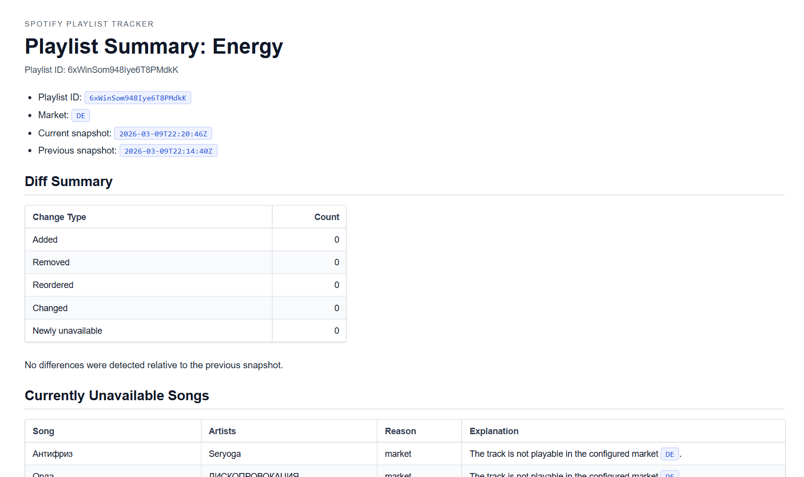

# Spotify Playlist Tracker

I got annoyed by Spotify randomly disappearing tracks my playlist without a way for me to easily notice or track the changes, so I created this project.

This project tracks Spotify playlist changes across repeated runs, stores snapshots and diffs, optionally renders markdown summaries, and can notify an external workflow via webhook (markdown & html for mail). It is designed to run either locally or inside Docker.

> Disclaimer: Quick, vibe-coded prototype for personal use.

## What It Does

- Fetches playlist items for the configured Spotify playlist IDs.
- Saves one snapshot JSON and one diff JSON on every run.
- Creates a markdown summary only on the initial run or when the diff contains removals, reorders, metadata changes, or newly unavailable tracks.
- Skips markdown summaries when the only changes are added tracks (can force with `--force-summary` parameter).
- Sends one webhook call per generated summary/playlist when `TRACKER_SUMMARY_WEBHOOK_URL` is configured.

The mail can look something like this:


## Runtime Configuration

Runtime configuration is environment-driven. The easiest local setup is to copy values into `.env`. The app needs to go through the Spotify authorization flow at least once to create the initial token file, which can then be reused for subsequent runs.

Required variables:

- `SPOTIFY_CLIENT_ID`
- `SPOTIFY_CLIENT_SECRET`
- `SPOTIFY_PLAYLIST_IDS`

Optional variables:

- `SPOTIFY_REDIRECT_URI`
  Default: `http://127.0.0.1:8899/callback`
  For a hosted Docker deployment, set this to your public callback URL such as `https://your-server.example.com/callback` or `http://your-server:8899/callback`.
- `SPOTIFY_MARKET`
  Default: `US`
- `SPOTIFY_INCLUDE_EPISODES`
  Default: `false`
- `TRACKER_RESULTS_DIR`
  Default: `results`
- `TRACKER_AUTH_FILE`
  Default: `state/.auth`
- `TRACKER_AUTH_BIND_HOST`
  Optional callback listener bind host. Leave empty for local runs. In Docker Compose this should be `0.0.0.0` while `SPOTIFY_REDIRECT_URI` can remain `http://127.0.0.1:8899/callback`.
- `TRACKER_SCHEDULE`
  Presets: `hourly`, `daily`, `weekly`, `monthly`
  Also supports a standard 5-field cron expression in UTC
- `TRACKER_SUMMARY_WEBHOOK_URL`
  Optional webhook endpoint for markdown summaries
- `TRACKER_WEBHOOK_TIMEOUT_SECONDS`
  Default: `15`

Example `.env` values are provided in `.env.example`.

## Commands

### `authorize`

Starts the Spotify authorization flow, saves the resulting token JSON to `TRACKER_AUTH_FILE`, and prints the saved `.auth` contents to stdout.

### `check`

Runs a single tracker pass.

Behavior:

- If the auth file already exists, it uses or refreshes it.
- If the auth file does not exist, it logs the Spotify authorization URL, waits for the callback, saves `.auth`, prints the saved `.auth` JSON to stdout, and then continues.
- `--force-summary` forces summary creation even if only added tracks are present or no change at all.

### `run`

Runs `check` immediately, then repeats based on `TRACKER_SCHEDULE`. Useful for long-running Docker deployments.

## Results

Results are written to `TRACKER_RESULTS_DIR`. Should be mounted as a volume in Docker for persistence and access on the host.

Files created per playlist run:

- `date_playlistname_playlistid_snapshot.json`
- `date_playlistname_playlistid_diff.json`
- `date_playlistname_playlistid_summary.md` when summary creation rules are met

## Auth Bootstrap Without a Preexisting `.auth`

If no auth file is present, the application now self-bootstraps authorization:

1. It logs the Spotify authorization URL! 
    - *IMPORTANT*: You must look at the logs to get this URL and open it in your browser to complete the flow.
2. It starts the localhost callback listener.
3. After Spotify redirects back, it exchanges the authorization code for tokens.
4. It writes the `.auth` file to `TRACKER_AUTH_FILE`.
5. It prints the full saved `.auth` JSON to stdout.
    - This is useful for container logs, one-off setup jobs, or hosted environments where you want to copy the token artifact out after the first authorization.

## Spotify App Callback Setup

Spotify requires the redirect URI to be explicitly allowlisted in your Spotify application settings.

Before using the authorization flow:

1. Open your Spotify developer application settings.
2. Add the exact callback URL you plan to use to the authorized redirect URIs list.
3. Make sure `SPOTIFY_REDIRECT_URI` matches that value exactly, including scheme, host, port, path, and trailing slash behavior.

Examples:

- Local run: `http://127.0.0.1:8899/callback`
- Hosted Docker on a public port: `http://your-server.example.com:8899/callback`
- Hosted Docker behind TLS and reverse proxy: `https://your-server.example.com/callback`

If the callback URL in Spotify does not exactly match `SPOTIFY_REDIRECT_URI`, authorization will fail.

## Docker

### Dockerfile

The repository includes a `Dockerfile` that installs the application into a slim Python image and defaults to:

```sh
spotify-playlist-tracker run
```

### Compose

The repository includes `docker-compose.yaml`.

Important details:

- `results` is mounted as a folder.
- auth state is mounted as a folder at `./state:/app/state`.
- the auth file path is `/app/state/.auth`.
- the callback listener bind host is set to `0.0.0.0` so the published container port can receive the Spotify redirect.
- port `8899` is published so the Spotify callback can reach the container.

This folder-based auth mount is more robust than binding a single file because the application may need to create the auth file when it does not exist yet.

Start it with:

```sh
docker compose up -d
```

If `.auth` does not exist yet, inspect the container logs, open the logged Spotify URL, complete the authorization flow, and then capture the emitted `.auth` JSON if needed.

### Hosted Server Deployment

If the container is running on a remote server instead of your local machine:

1. Set `SPOTIFY_REDIRECT_URI` to the public URL and port that can reach your server.
2. Add that exact callback URL to the Spotify application's authorized redirect URIs.
3. Make sure the server port is reachable from your browser and forwarded to the container.
4. Start the container.
5. Check the container logs for the generated Spotify authorization URL.
6. Open that logged URL in your browser from your own machine.
7. Complete the Spotify login and consent flow.
8. Let Spotify redirect back to your public server callback URL.

Important behavior:

- You must look at the container logs to get the current authorization URL when `.auth` is missing.
- The generated authorization URL includes a one-time `state` value, so use the current URL from the latest logs.
- After the callback succeeds, the container writes the token file to `TRACKER_AUTH_FILE`, which is `/app/state/.auth` in the provided compose setup and `./state/.auth` on the host.
- If you restart the container before finishing auth, a new authorization URL and `state` value will be generated.

For the provided compose file, the auth flow assumes:

- container listener bind host: `0.0.0.0`
- container callback port: `8899`
- host port published: `8899:8899`

If you use a reverse proxy or a different public port, update `SPOTIFY_REDIRECT_URI` accordingly and keep the proxy routing `/callback` to the container.

## Webhook Payload

When a summary is created and `TRACKER_SUMMARY_WEBHOOK_URL` is set, the application sends one POST request with JSON containing:

- playlist metadata
- timestamps
- market
- change counts
- generated filenames and paths
- rendered markdown summary content
- rendered HTML summary content in a separate `html` field

This is suitable for n8n workflows that want to send either the markdown or the pre-rendered HTML email body directly.

## GitHub Action

The workflow at `.github/workflows/docker-image.yml` builds and publishes the Docker image to GitHub Container Registry on pushes to `main`.

Registry target:

- `ghcr.io/<owner>/<repo>`

## Local Development

Create or update `.env`, then run:

```sh
python -m spotify_playlist_tracker authorize
python -m spotify_playlist_tracker check
```

Run tests with:

```sh
python -m pytest -q
```
